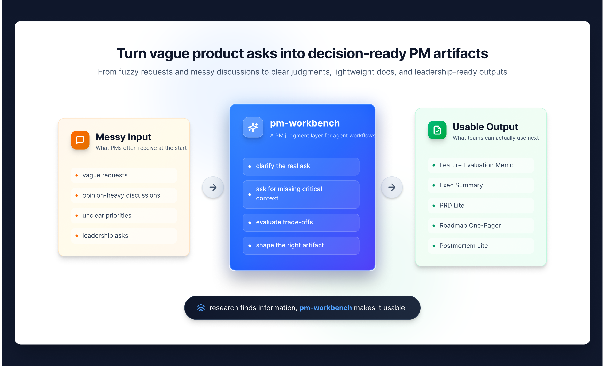
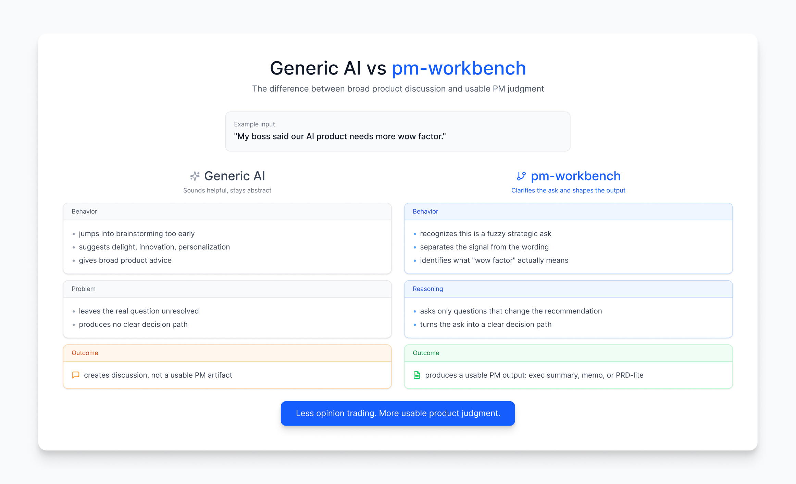

# pm-workbench

**Turn vague product asks into decision-ready PM artifacts.**

An AI PM workbench for product managers and product leaders.  
From fuzzy requests and messy discussions to clear judgments, lightweight docs, and leadership-ready outputs.

## Why it feels different

## 30-second overview

Most AI tools can talk about product work.
`pm-workbench` is designed to **do product work in a more usable way**.

It is especially good at:
- turning vague asks into clear product questions
- evaluating whether something is worth building
- comparing options and trade-offs
- drafting lightweight but usable PM artifacts
- helping PMs and product leaders communicate upward

This is **not** a generic PM prompt pack.
It is a **scenario-driven PM decision workbench**.

## What problem it solves

In real product work:
- vague requests turn into vague discussions
- feature evaluation becomes opinion trading
- PRDs become either bloated or shallow
- roadmap conversations become wish lists
- leadership updates bury the actual point
- postmortems describe symptoms but miss the lesson

`pm-workbench` is built to fix that.

## What makes it different

### 1. It routes by task, not by PM theory
Instead of dumping frameworks at you, it starts from the actual job:
- clarify the request
- evaluate the idea
- compare options
- prioritize requests
- draft the doc
- prepare the summary
- review the outcome

### 2. It asks for missing critical context
If 1–2 missing premises would change the recommendation, it asks first.
If not, it moves.

### 3. It produces artifacts, not just advice
Outputs are shaped like reusable PM deliverables, such as:
- Feature Evaluation Memo
- Executive Summary
- PRD Lite
- Roadmap One-Pager
- Postmortem Lite

### 4. It is built for actual product work
This is for meetings, reviews, leadership syncs, and decision-making — not just demo chats.

## Generic AI vs pm-workbench

### Input
> “My boss said our AI product needs more wow factor.”

### What generic AI often does
- jumps into brainstorming too early
- suggests delight, innovation, personalization, gamification
- sounds reasonable, but stays abstract
- leaves the real product question unresolved

### What `pm-workbench` should do
- recognize this is a fuzzy strategic ask, not a ready-made requirement
- separate the signal from the wording
- identify what “wow factor” may actually mean in this context
- ask the few missing questions that matter
- turn the ask into a clearer problem statement, decision path, or leadership-ready summary

### Why this matters
The difference is not just “better wording.”
It is the difference between **interesting discussion** and **usable product judgment**.

## Before vs after

### Before
Input:
> “My boss said our AI product needs more wow factor.”

Typical generic AI response:
- brainstorm some creative features
- suggest adding personalization, gamification, delight
- talk broadly about innovation and user experience

Result:
- sounds reasonable
- still unclear what the real problem is
- no usable PM output

### After
What `pm-workbench` should do:
- recognize this is a fuzzy strategic ask, not a ready-made requirement
- separate the signal from the wording
- identify what “wow factor” might actually mean
- ask the few missing questions that matter
- turn it into a clearer problem statement or leadership-ready summary

Result:
- less opinion trading
- more structured judgment
- a usable output that moves the work forward

## Core workflows

`pm-workbench` currently supports workflow patterns such as:
- clarify vague requests
- evaluate feature value
- compare solutions
- prioritize competing requests
- draft PRD / solution docs
- build roadmap plans
- design metrics
- prepare executive summaries
- write postmortems

## Built-in PM artifacts

When the task calls for it, `pm-workbench` can naturally shape outputs into:
- Feature Evaluation Memo
- Executive Summary
- PRD Lite
- Roadmap One-Pager
- Postmortem Lite

## Example use cases

### Clarify a vague request
> “Help me clarify this request before we jump to solutions.”

### Evaluate whether something is worth building
> “Operations wants a daily AI fortune card feature. I’m worried it’s a gimmick. Help me evaluate it.”

### Compare product directions
> “Compare these two product directions and recommend one.”

### Draft a lightweight PRD
> “Help me draft a lightweight PRD for conversation history search.”

### Prepare a leadership summary
> “Turn this into an executive summary for leadership.”

### Write a postmortem
> “We launched this last month and adoption was weak. Help me write a lightweight postmortem.”

## Best for

`pm-workbench` works best when you need:
- product judgment, not just content generation
- structure for ambiguous product conversations
- lightweight but usable PM deliverables
- clearer trade-off thinking
- stronger upward communication
- postmortem and learning loops

## Less ideal for

`pm-workbench` is less ideal for:
- analytics-heavy SQL or dashboard work
- pure research repository management
- highly specialized compliance or regulatory writing
- long enterprise documentation workflows with heavy governance
- tasks that depend more on raw data processing than product judgment

## Where it fits in an agent workflow

`pm-workbench` works especially well as the **PM judgment layer** in a larger workflow:
- research skills gather evidence
- `pm-workbench` turns evidence into decisions and artifacts
- document or slide skills turn those artifacts into shareable outputs
- visualization skills turn plans into leadership-ready visuals

In other words:
**research finds information, `pm-workbench` makes it usable.**

## Installation

### Option 1 — Use the packaged skill file
- packaged file: `output/pm-workbench.skill`
- import it through your OpenClaw skill installation flow

### Option 2 — Use the local source
- keep the source under your OpenClaw skills workspace
- current folder: `skills/pm-workbench/`

If you are iterating on the skill, use the source folder.
If you want the fastest install path, use the packaged `.skill` file.

## Even if you don’t use OpenClaw

You can still use this repository as:
- a PM workflow reference
- a reusable artifact library
- a set of structured prompting patterns
- a benchmark for evaluating PM-oriented agents

## Current status

`pm-workbench` is currently a validated and packaged v0:
- core workflows implemented
- artifact templates added
- artifact mapping wired into the skill
- compressed artifact behavior added for quick use
- packaged and ready for iteration

Already useful. Still evolving.

## Who this is for

- PMs dealing with vague requests and messy decisions
- senior PMs who need stronger judgment artifacts
- product leaders who need roadmap and executive communication support
- builders who want a reusable PM workflow system instead of a prompt collection
