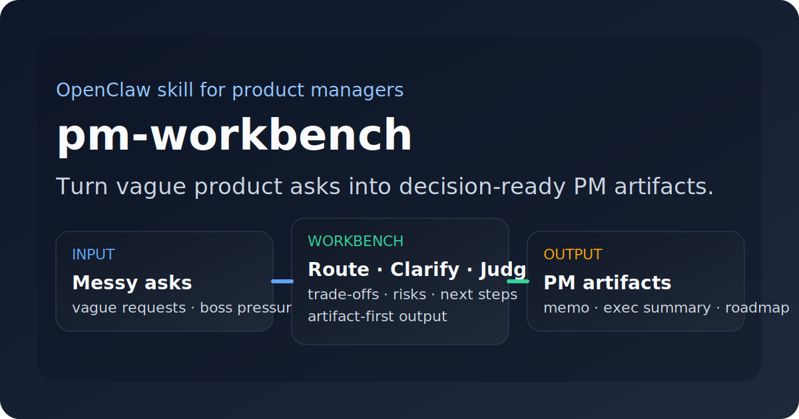
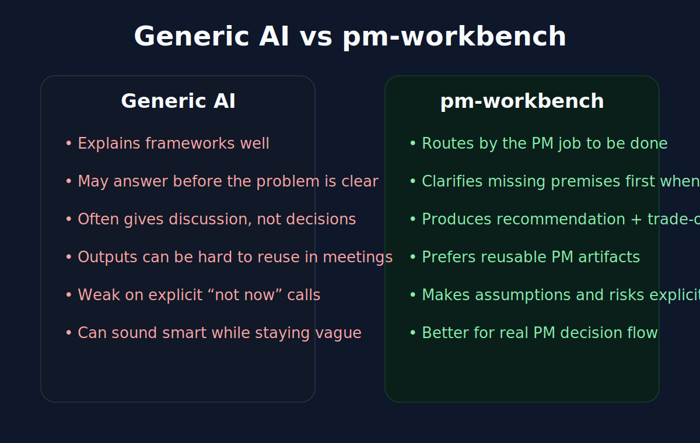
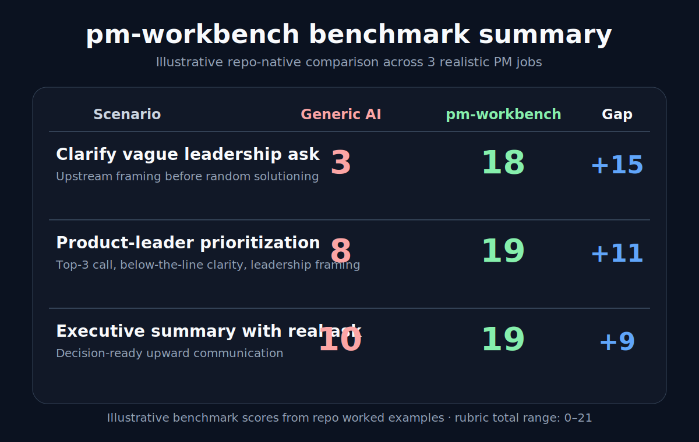

# pm-workbench

> **Turn vague product asks into decision-ready PM artifacts.**

`pm-workbench` is an OpenClaw skill for product managers, senior PMs, heads of product, and founders.
It is built for the real work between “someone asked for something” and “we need a recommendation, artifact, or next move that can survive stakeholder review.”

**Current release target:** `v1.0.0`

**What it is:** a scenario-driven PM judgment layer  
**What it is not:** a generic PM prompt pack, framework encyclopedia, or bloated PRD generator

- **Best for:** clarifying messy asks, evaluating feature value, comparing options, prioritizing under constraints, drafting lightweight PM docs, preparing leadership summaries, and turning launches into usable lessons
- **Especially strong for:** product-leader / founder trade-offs involving sequencing, resourcing, leadership communication, and explicit “not now” calls
- **Current local validation:** recognized as **Ready** by OpenClaw in the active workspace via `openclaw skills info pm-workbench` and `openclaw skills check`



## Why this feels different

Most AI tools can talk about product work.
`pm-workbench` is designed to **move product work forward**.

It is opinionated in a few useful ways:
- it routes by the **actual PM job to be done**, not by abstract framework recital
- it asks for **only the missing context that would change the recommendation**
- it prefers **artifacts you can reuse in meetings, reviews, and leadership syncs**
- it makes **trade-offs, assumptions, risks, and “not now” calls** explicit
- it works for both **single-feature PM work** and **product-leader communication / prioritization work**
- it now includes a **benchmark layer** so visitors can compare it against generic AI in realistic scenarios



## Benchmark snapshot

This repo now includes a visible proof layer, not just positioning copy.



Illustrative worked-example totals using the repo rubric:
- **Clarify vague leadership ask:** generic AI `3` vs `pm-workbench 18`
- **Product-leader prioritization:** generic AI `8` vs `pm-workbench 19`
- **Executive summary with real ask:** generic AI `10` vs `pm-workbench 19`

Why this matters:
- the repo now shows differentiation across **upstream framing**, **portfolio prioritization**, and **leadership communication**
- visitors can inspect the worked comparisons instead of relying on README claims
- benchmark contributions now have a documented contribution path

Start here:
- [Benchmark kit](benchmark/README.md)
- [Benchmark contribution guide](benchmark/CONTRIBUTING-BENCHMARKS.md)
- [Share-friendly benchmark card](docs/images/pm-workbench-benchmark-card.svg)

## Why a cold GitHub visitor should care

A lot of PM-flavored AI repos look good until you ask:
- does this help with an actual decision?
- does it make the trade-offs visible?
- can I reuse the output in a real review?
- does it work for product leadership, not just feature-writing?
- is there any proof beyond README claims?

`pm-workbench` is trying to answer **yes** to those questions.

## The product thesis

In real teams, PM work usually breaks down in one of these ways:
- vague asks turn into vague discussion
- solution ideas arrive before the problem is clear
- feature evaluation becomes opinion trading
- prioritization becomes politics or scorecard theater
- PRDs get too fluffy or too heavy
- roadmap reviews hide what is intentionally *not* being done
- leadership summaries bury the actual conclusion
- postmortems describe symptoms but fail to change future behavior

`pm-workbench` is built to reduce those failure modes.

## What you get

### 9 workflow paths

| PM job | Workflow | Default output shape |
|---|---|---|
| Clarify a fuzzy ask | `clarify-request` | Request Clarification Brief |
| Judge whether to do something | `evaluate-feature-value` | Feature Evaluation Memo |
| Choose between options | `compare-solutions` | Decision Brief |
| Rank competing work | `prioritize-requests` | Prioritization Stack |
| Draft a lightweight spec | `draft-prd` | PRD Lite |
| Turn priorities into a staged plan | `build-roadmap` | Roadmap One-Pager |
| Define success measurement | `design-metrics` | Metrics Scorecard |
| Prepare upward communication | `prepare-exec-summary` | Executive Summary |
| Learn from a launch / initiative | `write-postmortem` | Postmortem Lite |

### Artifact-first outputs

This repo does not stop at “analysis.”
It includes reusable PM artifact templates under `references/templates/` so the skill can naturally shape outputs into documents a PM can actually use.

Current built-in artifact library:
- Request Clarification Brief
- Feature Evaluation Memo
- Decision Brief
- Prioritization Stack
- PRD Lite
- Roadmap One-Pager
- Metrics Scorecard
- Executive Summary
- Postmortem Lite
- Portfolio Review Summary
- Head of Product Operating Review
- Founder Business Review

### Benchmark and trust layer

This repo now includes a concrete proof layer under [`benchmark/`](benchmark/README.md):
- realistic PM scenarios
- a comparison rubric
- a reusable scorecard
- three worked comparison artifacts
- a benchmark contribution guide
- a README-ready visual summary asset
- a share-friendly benchmark card

It also includes a lightweight local validation script so the repo can check its own structural integrity:

```bash
cd skills/pm-workbench
npm run validate
```

That is not glamorous, but it matters. Repos feel more trustworthy when they can verify more than prose.

## 5-minute evaluation

If you want to know whether this skill is for you, test it with 4 prompts:

### Prompt 1 — vague ask
> “My boss said our AI product needs more of a wow factor. Help me figure out what that actually means before we jump to solutions.”

What to look for:
- it should separate **problem / goal / proposed solution**
- it should ask only the **1–2 highest-value missing questions**
- it should turn the ask into a clearer product question

### Prompt 2 — feature value judgment
> “Operations wants a daily AI fortune card feature to improve engagement. I’m worried it’s a gimmick. Help me evaluate it.”

What to look for:
- it should not blindly mirror stakeholder enthusiasm
- it should weigh **user value, business value, strategic fit, cost, and opportunity cost**
- it should end with a clear **go / hold / no-go / experiment** recommendation

### Prompt 3 — product-leader prioritization
> “We only have room for 3 of these 8 requests next quarter. Help me prioritize them and explain what should wait.”

What to look for:
- it should anchor on the **period objective**
- it should say what is **top priority and what is explicitly not prioritized now**
- it should produce reasoning you can defend to leadership

### Prompt 4 — founder trade-off
> “Help me choose between a fast marketable AI layer and a slower but more trust-building product improvement path.”

What to look for:
- it should define the real decision objective under company conditions
- it should make sequencing and opportunity cost visible
- it should recommend one path or a staged path with conditions

If the outputs feel more like usable PM judgment than generic AI explanation, the skill is doing its job.

## How it behaves

### 1. Upstream first
It solves the most upstream bottleneck first.
If the request is still fuzzy, it clarifies before evaluating.
If evaluation is unresolved, it does not pretend the PRD is the real next step.

### 2. Minimum necessary questioning
It asks follow-up questions only when missing facts would materially change the answer.
If not, it moves.

### 3. Artifact-first by default
When a task naturally maps to a PM deliverable, it prefers a reusable artifact shape instead of loose analysis.

### 4. Fast-path friendly
If the user needs a quick take, it can produce a clearly labeled compressed artifact instead of stalling for perfect context.

### 5. Trade-off honest
It is expected to name:
- assumptions
- information gaps
- risks
- dependencies
- what should *not* be done now

### 6. Leader-mode aware
When the audience is a product leader, founder, or executive stakeholder, it should make:
- business consequence
- sequencing
- resourcing
- explicit asks

much easier to scan.

## Install and use

## Option 1 — use the source folder directly
This is the easiest and most transparent path.

1. Clone or copy this repository.
2. Place the `pm-workbench` folder under your OpenClaw skills workspace.
3. Verify the skill is recognized:
   ```bash
   openclaw skills info pm-workbench
   openclaw skills check
   ```
4. Start with a real PM prompt.

## Option 2 — use a packaged `.skill` in your own workflow
If your environment already produces or distributes packaged OpenClaw skills, this repo is structured cleanly enough for that path too.
But the default recommendation is still: **start from source, verify fast, then customize.**

## First prompts to try
- “Help me unpack this request before we jump to solutions.”
- “Should we build this feature, or is it not worth doing now?”
- “Compare these two directions and recommend one.”
- “Turn this into a one-page exec summary for leadership.”
- “Help me prioritize this quarter and say what should wait.”
- “Help me write a lightweight postmortem from this launch result.”

## Repository structure

```text
pm-workbench/
├── SKILL.md
├── README.md
├── CHANGELOG.md
├── CONTRIBUTING.md
├── ROADMAP.md
├── package.json
├── benchmark/
│   ├── README.md
│   ├── CONTRIBUTING-BENCHMARKS.md
│   ├── scenarios.md
│   ├── rubric.md
│   ├── scorecard.md
│   ├── worked-example-product-leader.md
│   ├── worked-example-clarify-request.md
│   └── worked-example-exec-summary.md
├── docs/
│   ├── GETTING-STARTED.md
│   ├── TRY-3-PROMPTS.md
│   ├── PRODUCT-LEADER-PLAYBOOK.md
│   └── images/
├── examples/
│   ├── 01-clarify-vague-request.md
│   ├── 02-feature-evaluation-memo.md
│   ├── 03-exec-summary.md
│   ├── 04-prd-lite.md
│   ├── 05-postmortem-lite.md
│   ├── 06-decision-brief.md
│   ├── 07-prioritization-stack.md
│   ├── 08-roadmap-one-pager.md
│   ├── 09-metrics-scorecard.md
│   ├── 10-product-leader-quarterly-priority-call.md
│   ├── 11-founder-strategy-decision.md
│   ├── 12-portfolio-review-summary.md
│   ├── 13-head-of-product-operating-review.md
│   ├── 14-founder-business-review.md
│   └── README.md
├── references/
│   ├── workflows/
│   └── templates/
└── scripts/
    └── validate-repo.js
```

## What to read next

- **Quick start:** [docs/GETTING-STARTED.md](docs/GETTING-STARTED.md)
- **Try it fast:** [docs/TRY-3-PROMPTS.md](docs/TRY-3-PROMPTS.md)
- **Benchmark kit:** [benchmark/README.md](benchmark/README.md)
- **Benchmark contribution guide:** [benchmark/CONTRIBUTING-BENCHMARKS.md](benchmark/CONTRIBUTING-BENCHMARKS.md)
- **Product leader guide:** [docs/PRODUCT-LEADER-PLAYBOOK.md](docs/PRODUCT-LEADER-PLAYBOOK.md)
- **Examples:** [examples/README.md](examples/README.md)
- **How to contribute:** [CONTRIBUTING.md](CONTRIBUTING.md)
- **Where the skill is going:** [ROADMAP.md](ROADMAP.md)

## Best for

`pm-workbench` is especially strong when you need:
- clearer framing for ambiguous product asks
- fast but defendable feature / initiative judgment
- structured option comparison with a recommendation
- prioritization that reflects real constraints
- lightweight PM artifacts instead of AI rambling
- sharper upward communication for product leaders
- roadmap and resource trade-offs that show explicit non-decisions
- founder-style decisions around speed, quality, narrative, and trust
- portfolio review summaries that sharpen above-the-line / below-the-line calls
- operating reviews that turn mixed signals into leadership decisions
- founder business reviews that separate narrative momentum from business truth
- postmortems that create reusable learning, not ceremony

## Less ideal for

It is less ideal for:
- pure SQL / data analysis heavy work
- research repository management
- highly specialized legal / compliance writing
- deeply operational execution tracking tools
- tasks where raw data processing matters more than product judgment

## Validation and quality bar

This repo is being built with a pretty simple quality bar:
- the main `SKILL.md` stays concise and routing-oriented
- detailed behavior lives in workflow references
- reusable output shapes live in templates
- examples should show realistic PM usage, not just abstract format descriptions
- docs should reduce adoption friction for someone discovering the repo cold
- benchmark assets should make side-by-side comparison possible
- local validation should catch obvious structural drift early

Local verification completed in the active workspace:
- `openclaw skills info pm-workbench` -> **Ready**
- `openclaw skills check` -> `pm-workbench` recognized as ready to use

## Contributing

If you want to improve the skill, please do it in a product-minded way:
- strengthen judgment quality, not just template volume
- prefer artifacts that help real PM work move forward
- add examples when adding new workflows or templates
- keep claims in docs honest and easy to verify
- use benchmark scenarios to challenge the repo, not just flatter it

Start here: [CONTRIBUTING.md](CONTRIBUTING.md)

## Roadmap

Short version:
- improve onboarding and evaluation assets
- deepen artifact coverage for more PM workflows
- strengthen product-leader / strategy use cases
- add sharper benchmark scenarios and validation loops
- make the repo easier for contributors to extend without bloating the core skill

See the fuller plan in [ROADMAP.md](ROADMAP.md).

## Bottom line

`pm-workbench` is for PMs who do not need more theory theater.
They need help turning ambiguity into:
- a clearer problem
- a stronger recommendation
- a reusable artifact
- a better decision
